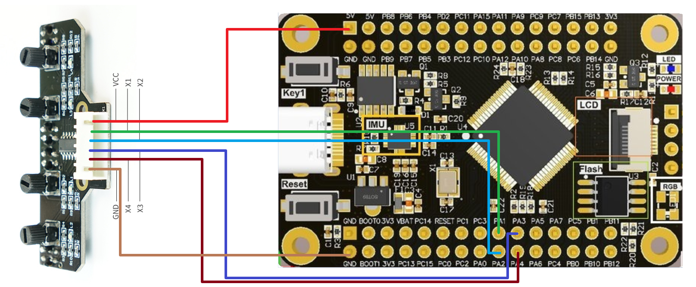

# Four-way line patrol module: GPIO input

### Hardware wiring



| LED  | Four-way line patrol module | STM32F103RCT6 |
| :--: | :-------------------------: | :-----------: |
|      |             VCC             |    5V/3.3V    |
|  L1  |             X1              |      PA1      |
|  L2  |             X2              |      PA2      |
|  L3  |             X3              |      PA3      |
|  L4  |             X4              |      PA4      |
|      |             GND             |      GND      |

### Brief principle

You can read the high and low levels of X1, X2, X3, and X4 to determine which black line is detected.

Black line detected:

The light is on The four-way line patrol module corresponds to the interface output low level

White line detected:

Lamp off The four-way line patrol module corresponds to the interface output high level

### Main code

#### main.c

```
#include "stm32f10x.h"
#include "UART.h"
#include "SysTick.h"
#include "Line_Walking.h"

int main(void)
{

    SysTick_Init();//滴答定时器初始化
    UART1_Init();//UART1初始化
	Line_Walking_GPIO_Init();//四路巡线模块初始化
	
    while(1)
    {
			Line_Walking_State();
			Delay_us(1000000);
    }
}
```

#### SysTick.c

```
#include "SysTick.h"

unsigned int Delay_Num;

void SysTick_Init(void)//滴答定时器初始化
{
    while(SysTick_Config(72));//设置重装载值 72 对应延时函数为微秒级
    //若将重装载值设置为72000 对应延时函数为毫秒级
    SysTick->CTRL &= ~(1 << 0);//定时器初始化后关闭，使用再开启
}

void Delay_us(unsigned int NCount)//微秒级延时函数
{
    Delay_Num = NCount;
    SysTick->CTRL |= (1 << 0);//开启定时器
    while(Delay_Num);
    SysTick->CTRL &= ~(1 << 0);//定时器初始化后关闭，使用再开启
}

void SysTick_Handler(void)
{
    if(Delay_Num != 0)
    {
        Delay_Num--;
    }
}
```

#### SysTick.h

```
#ifndef __SYSTICK_H__
#define __SYSTICK_H__

#include "stm32f10x.h"

void SysTick_Init(void);//滴答定时器初始化
void Delay_us(unsigned int NCount);//微秒级延时函数

#endif
```

#### UART.c

```
#include "UART.h"

void UART1_Init(void)//UART1初始化
{
    USART_InitTypeDef USART_InitStructure;
    GPIO_InitTypeDef GPIO_InitStructure;

    /* Enable GPIO clock */
    /* 使能GPIOA AFIO时钟 TXD(PA9) RXD(PA10) */
    RCC_APB2PeriphClockCmd(RCC_APB2Periph_GPIOA | RCC_APB2Periph_AFIO, ENABLE);

    /* Enable USART1 Clock */
    /* 使能串口1 */
    RCC_APB2PeriphClockCmd(RCC_APB2Periph_USART1 , ENABLE); 

    /* Configure USART1 Rx as input floating */
    /* 配置RXD引脚 PA10 浮空输入模式 */
    GPIO_InitStructure.GPIO_Pin = GPIO_Pin_10;
    GPIO_InitStructure.GPIO_Mode = GPIO_Mode_IN_FLOATING;
    GPIO_Init(GPIOA, &GPIO_InitStructure); 

    /* Configure USART1 Tx as alternate function push-pull */
    /* 配置TXD引脚 PA9 复用推挽输出模式 */
    GPIO_InitStructure.GPIO_Pin = GPIO_Pin_9;
    GPIO_InitStructure.GPIO_Speed = GPIO_Speed_50MHz;
    GPIO_InitStructure.GPIO_Mode = GPIO_Mode_AF_PP;
    GPIO_Init(GPIOA, &GPIO_InitStructure); 

    /* USART1 configured as follow:
    - BaudRate = 115200 baud  
    - Word Length = 8 Bits
    - One Stop Bit
    - No parity
    - Hardware flow control disabled (RTS and CTS signals)
    - Receive and transmit enabled
    */
    USART_InitStructure.USART_BaudRate = 115200;//波特率设置
    USART_InitStructure.USART_WordLength = USART_WordLength_8b;//8位数据位
    USART_InitStructure.USART_StopBits = USART_StopBits_1;//1位停止位
    USART_InitStructure.USART_Parity = USART_Parity_No;//无奇偶校验位
    USART_InitStructure.USART_HardwareFlowControl = USART_HardwareFlowControl_None;//无需硬件流控
    USART_InitStructure.USART_Mode = USART_Mode_Rx | USART_Mode_Tx;//全双工 即发送也接受
    USART_Init(USART1, &USART_InitStructure);

    /* Enable USART1 Receive and Transmit interrupts */
    USART_ITConfig(USART1, USART_IT_RXNE, ENABLE);
    USART_ITConfig(USART1, USART_IT_TXE, ENABLE);

    /* Enable the USART1 */
    /* 使能USART1 */
    USART_Cmd(USART1, ENABLE);
}

void NVIC_UART1_Init(void)//UART1 NVIC配置
{
    NVIC_InitTypeDef NVIC_InitStructure;

    /* Configure the NVIC Preemption Priority Bits */  
    NVIC_PriorityGroupConfig(NVIC_PriorityGroup_0);

    /* Enable the USART1 Interrupt */
    NVIC_InitStructure.NVIC_IRQChannel = USART1_IRQn;
    NVIC_InitStructure.NVIC_IRQChannelSubPriority = 0;
    NVIC_InitStructure.NVIC_IRQChannelCmd = ENABLE;
    NVIC_Init(&NVIC_InitStructure);
}


void USART_SendString(USART_TypeDef* USARTx, char *pt)//给指定串口发送字符串
{
    while(*pt)
    {
        while(USART_GetFlagStatus(USARTx, USART_FLAG_TXE) == RESET);
        USART_SendData(USARTx,*pt);
        while(USART_GetFlagStatus(USARTx, USART_FLAG_TC) == RESET);
        pt++;    
    }
}

int fputc(int c, FILE *pt)//printf重定向
{
    USART_TypeDef* USARTx = USART1;
    while(USART_GetFlagStatus(USARTx, USART_FLAG_TXE) == RESET);
    USART_SendData(USARTx, c);
    while(USART_GetFlagStatus(USARTx, USART_FLAG_TC) == RESET);    
    return 0;
}

void USART1_IRQHandler(void)
{
    unsigned char ch;
    while(USART_GetFlagStatus(USART1, USART_FLAG_RXNE) == SET)//接收到数据
    {
        ch = USART_ReceiveData(USART1);
        printf("%c\n",ch);
    }
}
```

#### UART.h

```
#ifndef __UART_H__
#define __UART_H__

#include "stm32f10x.h"
#include "stdio.h"

void UART1_Init(void);//UART1初始化
void USART_SendString(USART_TypeDef* USARTx, char *pt);//给指定串口发送字符串
int fputc(int c, FILE *pt);//printf重定向
void NVIC_UART1_Init(void);//UART1 NVIC配置

#endif
```

#### Line_Walking.c

```
#include "Line_Walking.h"

//四路巡线模块引脚初始化
void Line_Walking_GPIO_Init(void)
{
	GPIO_InitTypeDef GPIO_InitStructure;
	
	/* GPIOA Periph clock enable */
	/* 使能 DPIOA 时钟 */
	RCC_APB2PeriphClockCmd(RCC_APB2Periph_GPIOA, ENABLE);
	
	/* Configure PA1 - PA4 in GPIO_Mode_IPU mode */
	//四路循线模块对应 X1:PA1	X2:PA2	X3:PA3	X4:PA4
	GPIO_InitStructure.GPIO_Pin = GPIO_Pin_1 | GPIO_Pin_2 | GPIO_Pin_3 | GPIO_Pin_4;
	GPIO_InitStructure.GPIO_Mode = GPIO_Mode_IPU;
	GPIO_Init(GPIOA, &GPIO_InitStructure);
}

/*
说明：
			本例程只提供简单的模块测试功能，可以通过该例程调节循迹模块的灵敏度
			并未涉及四路循迹模块多种情况判断。

			若想驱动小车：可结合自己的电机驱动代码文件
			对循迹模块的各个检测状态进行判断，根据判断加入电机驱动控制
*/

void Line_Walking_State(void)//四路循迹模块 检测状态
{
	if(GPIO_ReadInputDataBit(GPIOA, GPIO_Pin_1) == Bit_SET)
	{
		printf("X1\n");
	}
	if(GPIO_ReadInputDataBit(GPIOA, GPIO_Pin_2) == Bit_SET)
	{
		printf("X2\n");
	}
	if(GPIO_ReadInputDataBit(GPIOA, GPIO_Pin_3) == Bit_SET)
	{
		printf("X3\n");
	}
	if(GPIO_ReadInputDataBit(GPIOA, GPIO_Pin_4) == Bit_SET)
	{
		printf("X4\n");
	}
}
```

#### Line_Walking.h

```
#ifndef __LINE_WALKING_H__
#define __LINE_WALKING_H__

#include "stm32f10x.h"
#include "UART.h"

void Line_Walking_GPIO_Init(void);//四路巡线模块引脚初始化
void Line_Walking_State(void);//四路循迹模块模块对应检测状态

#endif
```

## Phenomenon

After downloading the program, press the Reset key once, and the downloaded program will run.

When you block the infrared sensor corresponding to the four-way line patrol module, the serial port will print the corresponding information.


Note:
This routine only provides a simple module test function, and does not involve multiple judgments of four-way tracking modules, and the sensitivity of the tracking module can be adjusted through this routine.

If you want to drive a car: only ideas are provided

Combined with its own motor drive code file, the detection status of the tracking module can be judged, and the motor drive control can be added according to the judgment

